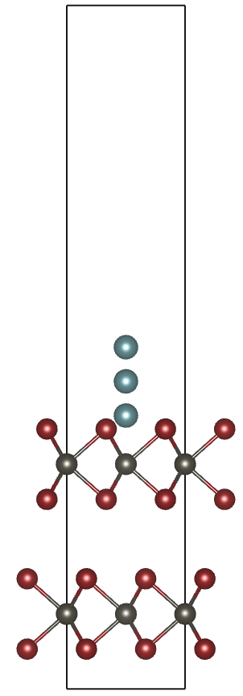
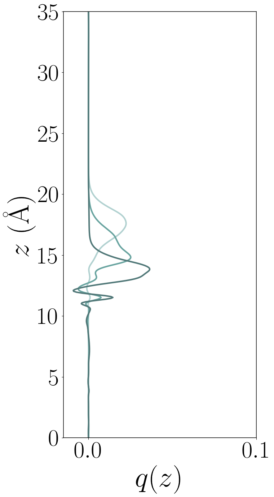
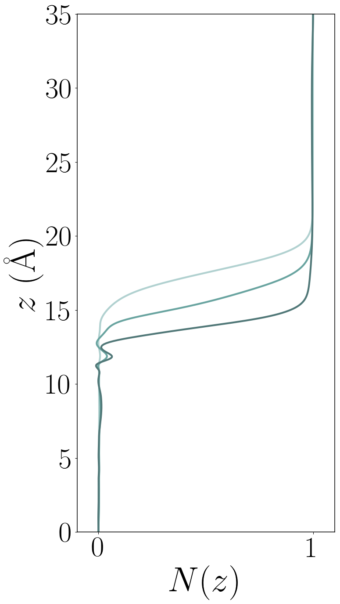

# Calculations of lithiation of bilayer

These calculations use the SCAN + rVV10 exchange-correlation
functional. There are several steps in these calculations, each of
which is performed in a separate folder, summarized here:

- `1-relax-bilayer/`: perform variable-cell relaxation on the bilayer
  (IBRION=2; ISIF=3) to allow the lattice constants and atom positions
  to change.
- `2-relax-bilayer-fixed/`: take the a, b lattice constants from (1) and
  use these in a new relaxation in which the cell is not allowed to
  change (IBRION=2; ISIF=2). The lattice constants (a,b) used are not
  taken exactly from `1-relax-bilayer` because we want to enforce the
  orthorhombic cell exactly.
- `3-Li-bilayer-0.5/`: Using the relaxed bilayer from (2), add a
  lithium atom at [0.5, 0.5, 0.5] in the cell and perform an electronic
  relaxation (fixed ions, fixed lattice: IBRION=-1).  Also switch to
  tetrahedral integration for higher accuracy calculations.
- `4-Li-bilayer-0.45/`: Same as 3, but with the Li atom at [0.5, 0.5, 0.45]
- `5-Li-bilayer-0.4/`: Same as 3, but with the Li atom at [0.5, 0.5, 0.4]
- `6-bilayer-only/`: Same as 3, but without the Li atom (needed so
  that we can subtract the charge density from folders 3,4,5.

Running `plotcharge-diff.py` produces the pictures in the `pics/`
folder here. In addition, a unit cell with all 3 Li atoms is provided
in the `pics/` folder.

### Bilayer and locations of the 3 Li atoms considered

### z position in the cell vs. charge density at that position

### z position in the cell vs. integrated charge density up to that position

