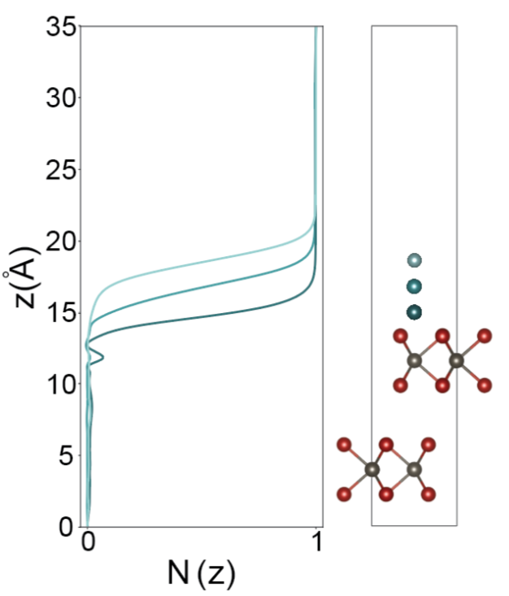

# Lithiation results

This folder contains calculations (`calculations` folder) of the
amount of charge transferred from a Li atom to the bottom layer of a
bilayer of 2H-MoTe2. The purpose is to investigate the extent to which
electrostatic doping could lead to charge transfer through the top
layer into the bottom layer. We use the SCAN + rVV10 xc functional to
treat the van der Waals interactions between layers more
accurately. We find very little charge transfer, as seen in the figure
below.

The results in the figure are for a bilayer of 2H. However, we have
also studied the charge transfer of different bilayer compositions,
including 1T'-on-2H and 1T'-on-1T'. The results are qualitatively the
same in all cases: no charge is transferred to the bottom layer.
