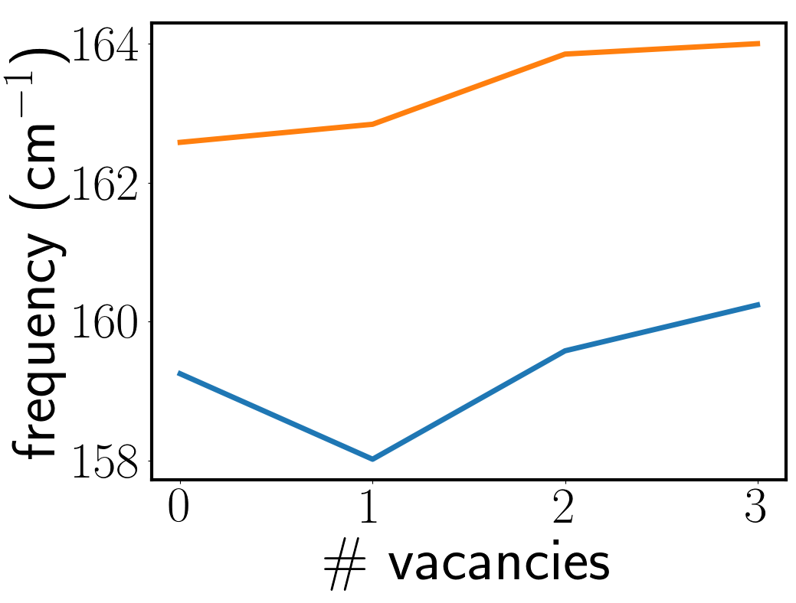
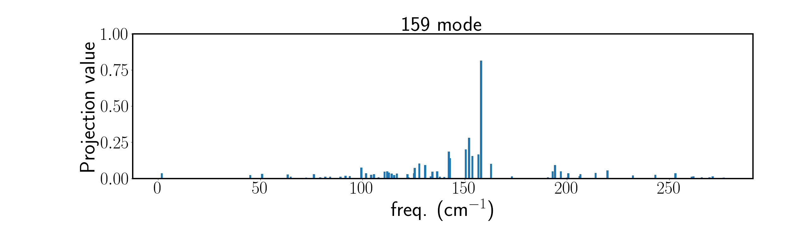
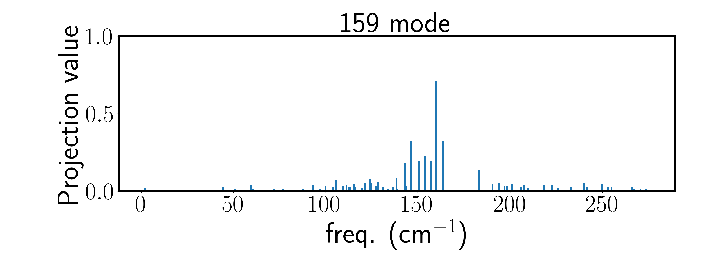
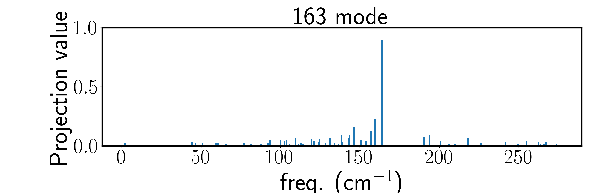
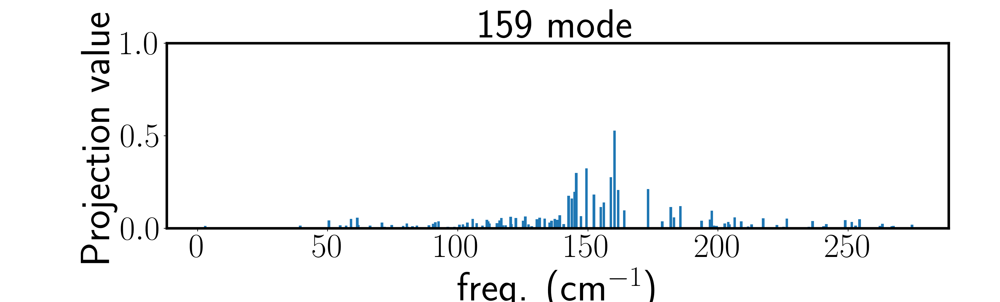

# Results of the projection studies

First we look at the frequency shifts of the 0-vacancy 159
cm-1 and 163 cm-1 modes when adding 1, 2, and 3
Te vacancies (out of 32 Te atoms total). 

# 1/32 Te vacancy concentration

# 2/32 Te vacancy concentration

# 3/32 Te vacancy concentration

