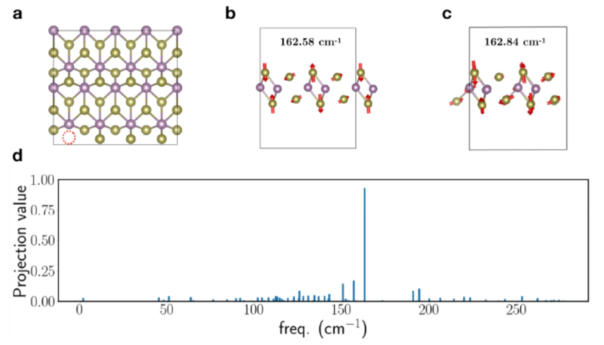

# Projection calcualtions

Two subfolders contain the following:

- `calculations`: All VASP files needed to compute the Raman modes
  (excluding POTCAR files).
- `analysis`: folder containing python files for calculating
  projections and analyzing the vibrational modes

The main results of the paper are shown in this figure,

