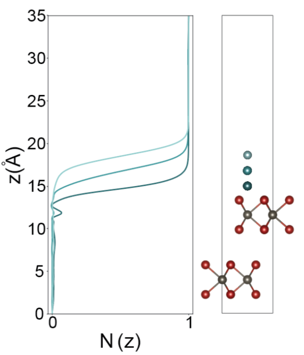

# MoTe2 Multi-layer phase change calculations

This repo is intended to support the paper _Reversible Electrochemical
Phase Change in Monolayer to Bulk MoTe2 by Ionic Liquid Gating_,
submitted to arXiV in May 2019.

There are two folders with two different sets of calculations:

- `raman`: contains DFT calculations were performed and included in
  the main text and the supplementary information.  The main text
  included charge transfer calculations from a Li atom on a bilayer of
  2H-MoTe2. These calculations use the SCAN+rVV10 functional to
  investigate the possibility of charge transfer from the Li atom
  through the top layer and into the layer below. We do not find any
  appreciable charge transfer, shown in the following figure:

  

  The calculations done to produce the above figure are found in t

- `projections`: contains an analysis of Raman modes in a supercell of
  monolayer 1T'-MoTe2. The purpose of these calculations is to assess
  the degree to which an active Raman mode continues to exist when Te
  vacancies are present in the sample.  The results involve
  projections of the computed modes with different Te vacancy
  concentrations onto the pristine (0 vacancy) raman spectrum. The
  results are shown in the figure below and included in the SI of the
  paper.
  
  
  
  We see here that the Raman-active mode at 162.84 cm-1 of 1T'-MoTe2
  with 1/32 = 3.125% vacancy concentration (**a,c**) shows a very high
  degree of similarity with the mode of the pristine sample at 162.58
  cm-1 (**b**). These modes exhibit a similarity in terms of a
  projection operation up to 93% (**d**), where the projection
  operation is defined in the SI of the paper.
  
  
  
- `Note`: additional calculations done for this project can be found
  at
  [https://github.com/rehnd/MoTe2-Salleo](https://github.com/rehnd/MoTe2-Salleo) by
  request.
