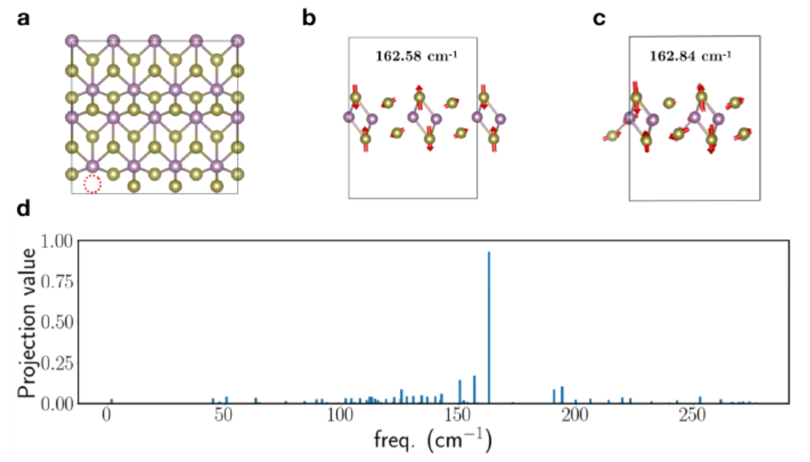

# MoTe2 Multi-layer phase change calculations

This repo is intended to support the
paper
[Reversible Electrochemical Phase Change in Monolayer to Bulk MoTe2 by Ionic Liquid Gating](https://arxiv.org/abs/1905.12746),
submitted to arXiV in May 2019.

There are two folders with two different sets of calculations:

- `lithiation`: contains DFT calculations of lithiation of a bilayer
  of MoTe2.  The main text includes charge transfer calculations from
  a Li atom on a bilayer of 2H-MoTe2. These calculations use the
  SCAN+rVV10 functional to investigate the possibility of charge
  transfer from the Li atom through the top layer and into the layer
  below, as a model for charge transfer in the case of ionic liquid
  doping. We do not find any appreciable charge transfer, shown by
  N(z), the integrated fraction of the excess electron from the
  lithium atom at location z, in the following figure:

  

  The calculations done to produce the above figure are found in the
  `lithiation/calculations` folder.

- `projections`: contains an analysis of Raman modes in a supercell of
  monolayer 1T'-MoTe2. The purpose of these calculations is to assess
  the degree to which a Raman-active vibrational mode continues to
  exist when Te vacancies are present in the sample.  The results
  involve projections of the computed modes with different Te vacancy
  concentrations onto the pristine (0 vacancy) raman spectrum. The
  results are shown in the figure below and included in the SI of the
  paper.
  
  
  
  Here, the Raman-active mode at 162.84 cm-1 of 1T'-MoTe2
  with 1/32 = 3.125% vacancy concentration (**a,c**) shows a very high
  degree of similarity with the mode of the pristine sample at 162.58
  cm-1 (**b**). These modes exhibit a similarity in terms
  of a projection operation up to 93% (**d**), where the projection
  operation is defined in the SI of the paper.
  
  
  
- `Note`: additional calculations done for this project are available
  by request.
